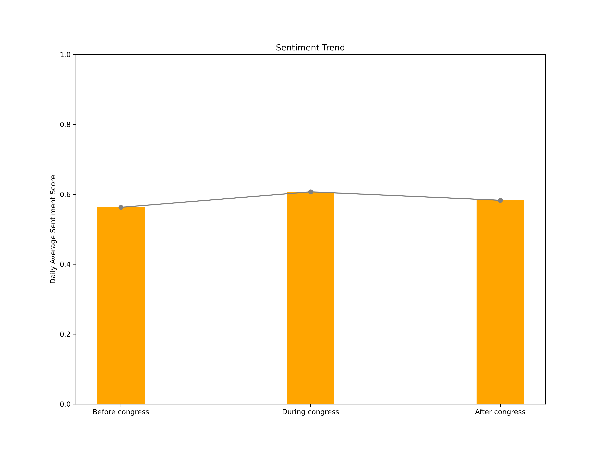
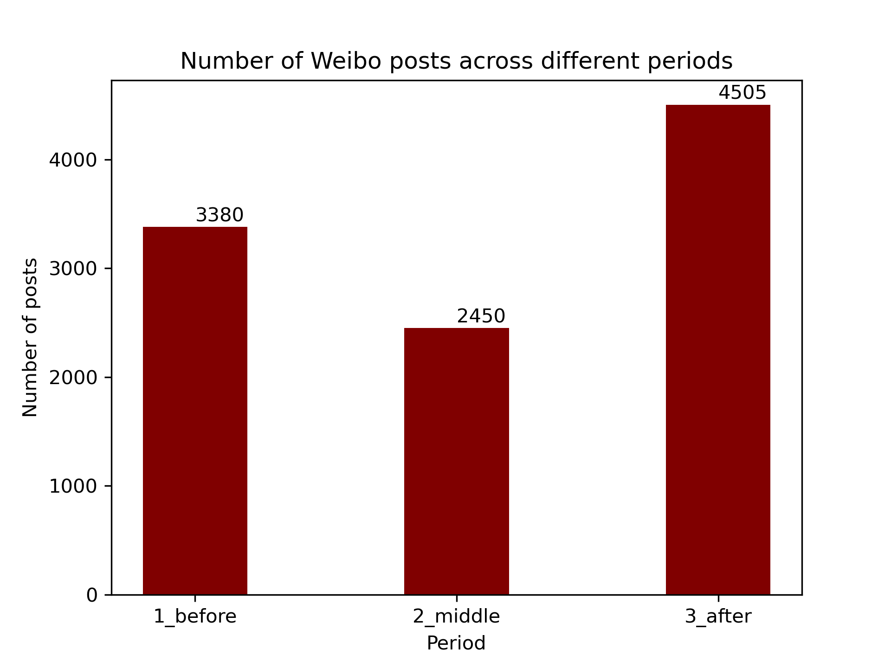
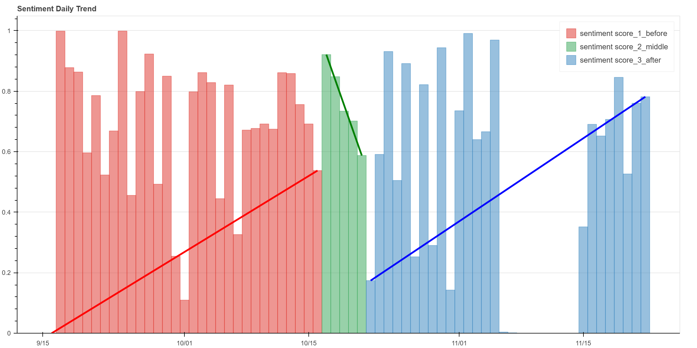
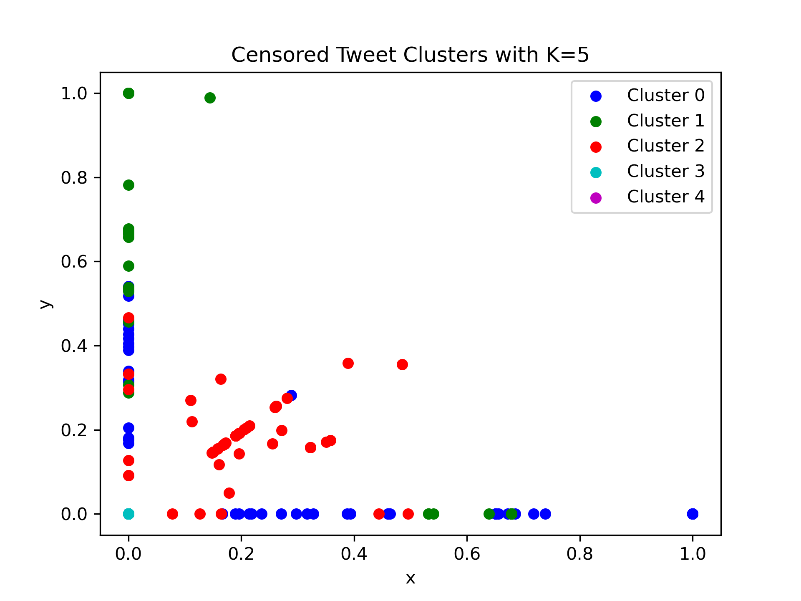
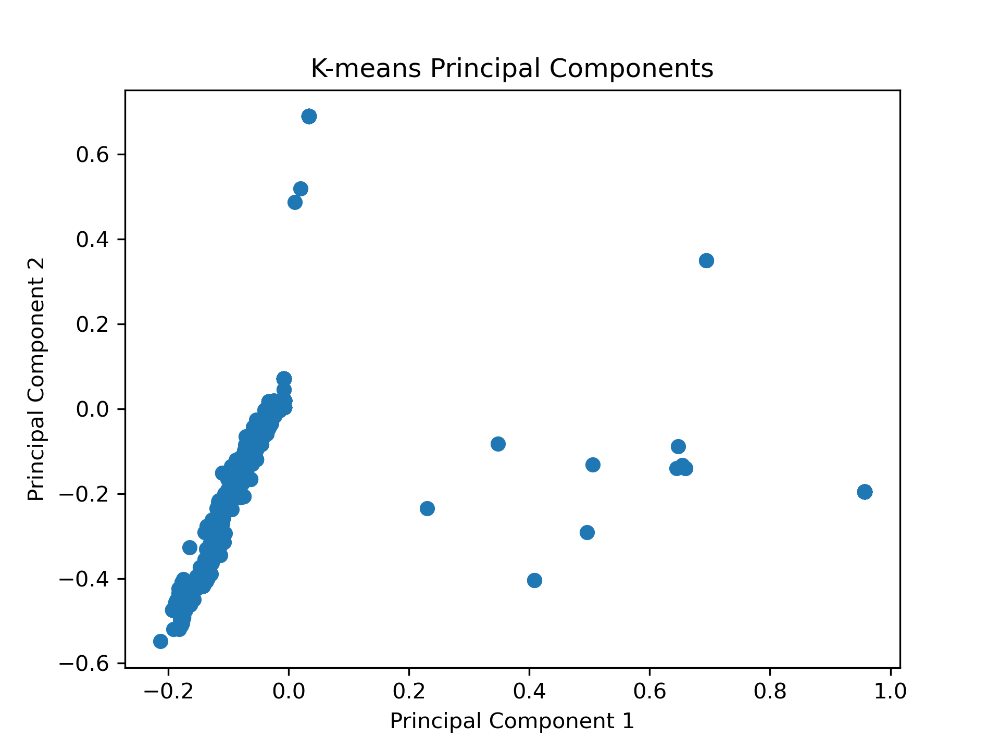
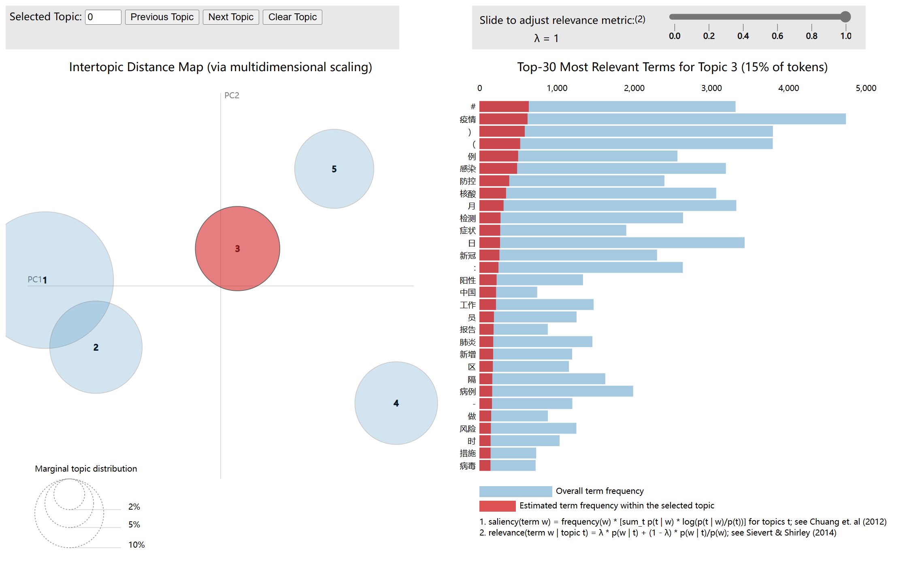
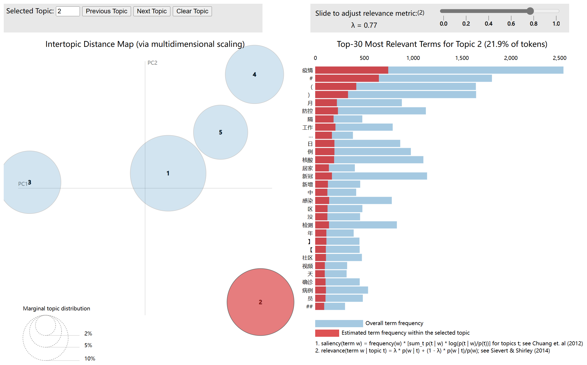
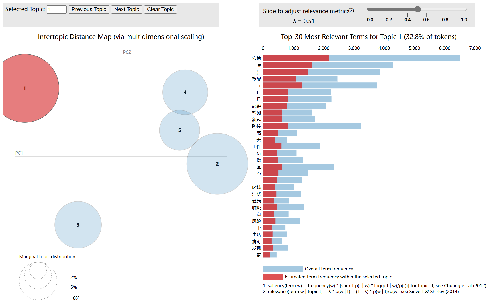

# final-pj-weibo
Final sub project for Weiboscope.

## Sentiment Trend

## Topic

### Html demonstration

Give 3 pictures to show the topic distribution. The original html is in `log/visualization`, and is interactive.

## Word Cloud

